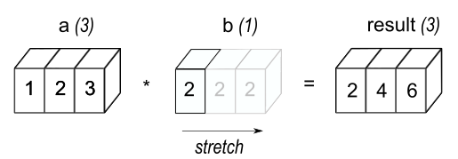
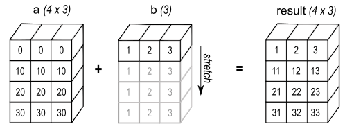
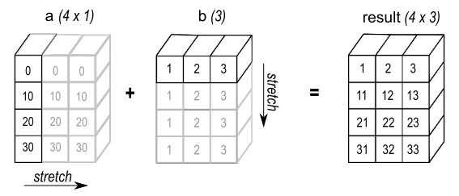

# NumPy 101 ⚡

```bash
pip install numpy
```

```bash
uv add numpy
```


---

### What is NumPy?

- **Numerical Python** = arrays + fast math  
- More compact and faster than Python lists  
- Supports broadcasting, vectorization, and linear algebra

How to import `numpy`:
```python
import numpy as np
```

---

### Creating arrays

```python
a = np.array([1, 2, 3])  # vector
b = np.array([[1, 2], [3, 4]]) # 2 by 2 matrix
```

Common constructors:

```python
np.zeros((2, 3))
np.ones((3,))
np.eye(3)            # identity
np.arange(0, 10, 2)
np.linspace(0, 1, 5)
```

---

### Array properties

Classical attributes of an array:
```python
a.shape   # dimensions
a.ndim    # number of axes
a.size    # number of elements
a.dtype   # element type
```

NumPy uses float64/int64 by default but it can handle other dtypes:
```python
x = np.array([1.0, 2.0, 3.0], dtype=np.float32)
```

💡 PyTorch/JAX use float32/int32 by default!

---

### Indexing & slicing

```python
x = np.array([[10, 20, 30], [40, 50, 60]])
x[1, 2]     # element
x[:, 1]     # column
x[0]        # row
x[0:2, 1:]  # submatrix
```

Boolean & fancy indexing:

```python
x[x > 30]         
x[[0, 1], [1, 2]]
```

---

### Array operations

Element-wise:

```python
a = np.array([1, 2, 3])
b = np.array([10, 20, 30])
a + b
a * b
a ** 2
```

Aggregate functions:

```python
np.sum(a), np.mean(a), np.std(a)
```

---

### Broadcasting

Works on arrays of different shapes:

```python
a = np.array([[1], [2], [3]])
b = np.array([10, 20, 30])
a + b
```

The result is:
```bash
array([[11, 21, 31],
       [12, 22, 32],
       [13, 23, 33]])
```

Very powerful: no loops needed.

---

### Broadcasting

**Adding a scalar to a vector**
```python
import numpy as np
a = np.array([1.0, 2.0, 3.0])
b = 2.0
a + b
```



---

### Broadcasting

**Adding a vector to a matrix**
```python
import numpy as np
a = np.array([[ 0.0,  0.0,  0.0],
              [10.0, 10.0, 10.0],
              [20.0, 20.0, 20.0],
              [30.0, 30.0, 30.0]])
b = np.array([1.0, 2.0, 3.0])
a + b
```



---

### Broadcasting

**Outer product/sum**
```python
import numpy as np
a = np.array([0.0, 10.0, 20.0, 30.0])
b = np.array([1.0, 2.0, 3.0])
a[:, np.newaxis] + b
```



---

### Broadcasting: distance matrix 🔥

Let $X$ be a matrix of shape $(2, 3)$ that represents two vectors of length $3$.

```python
X = np.array([[1.0, 2.0, 3.0], [4.0, 5.0, 6.0]])
```

Compute the distance matrix defined as:

$$D_{ij} = \|x_i - x_j\|_2^2$$

where $x_i$ is the i-th line of $X$.

- Try with a for loop
- Then with broadcasting

---

### Solution

```python
diff = X[:, None, :] - X[None, :, :]
D = np.sum(diff**2, axis=-1)
```

- `X[:, None, :]` has shape `(2, 1, 3)`
- `X[None, :, :]` has shape `(1, 2, 3)`
- Broadcasting makes them compatible: result is `(2, 2, 3)`.
- Each `[i, j, :]` slice contains $x_i - x_j$.

---

### Reshaping arrays

```python
a = np.arange(6)
a.reshape((2, 3))
a.flatten()   # copy
a.ravel()     # view
a.T           # transpose
```

Add dimensions:

```python
a[:, np.newaxis]
np.expand_dims(a, axis=0)
```

---

### Linear algebra basics

Create a matrix and a vector
```python
A = np.array([[1, 2], [3, 4]])
b = np.array([5, 6])
```

A few possible methods:
```python
np.dot(A, b)       # dot
A @ A              # matrix mult
np.linalg.inv(A)   # inverse
np.linalg.solve(A, b)
```

NumPy ≠ full linear algebra library, but covers essentials.

---

### Random numbers

If you need reproductibility:
```python
np.random.seed(0)
```

There a several random generation methods:
```
np.random.rand(2, 3)       # uniform [0,1)
np.random.randn(3)         # normal
np.random.integers(1, 10, (2, 2))
np.random.choice([1, 2, 3], size=5)
```

---

### Practical example: distance

Let $a \in \mathbb{R}^2$ and $b \in \mathbb{R}^2$. We want to compute

$$
\|a - b\|_2 = \sqrt{\sum_{i=1}^{2}(a_i - b_i)^2}
$$

```python
a = np.array([1, 2])
b = np.array([4, 6])

dist = np.linalg.norm(a - b)
```

---

### Practical example: normalize rows

Let $X \in \mathbb{R}^{2 \times 2}$. We want to normalize each row of $X$ by its norm.

Pick a random matrix
```python
X = np.array([[1, 2], [3, 4]])
```

Compute norm along the column axis
```python
row_norms = np.linalg.norm(X, axis=1, keepdims=True)
X_normed = X / row_norms
```

---

### Practical example: Monte Carlo estimation of π

We sample points uniformly in the unit square $[0,1]^2$.  
The probability of falling inside the quarter unit circle is $\pi/4$.

$$
\pi \approx 4 \cdot \frac{1}{N} \sum_{i=1}^N \mathbf{1}_{\mathcal{S}}(x_i), 
\quad x_i \sim \mathcal{U}([0,1]^2)
$$

```python
N = 10000
x = np.random.rand(N)
y = np.random.rand(N)
inside = x**2 + y**2 <= 1
pi_est = 4 * np.sum(inside) / N
```

---

### Recap

- Arrays: fast, compact, vectorized  
- Indexing, slicing, broadcasting  
- Reshape and transpose  
- Basic linear algebra  
- Random numbers for simulations  

NumPy is the foundation of many scientific stacks in Python.

---

### Resources

- [NumPy homepage](https://numpy.org)  
- [User Guide](https://numpy.org/doc/stable/user/)  
- [Quickstart Tutorial](https://numpy.org/doc/stable/user/quickstart.html)  
- [Reference](https://numpy.org/doc/stable/reference/)
- [NumPy 100 exercises](https://github.com/rougier/numpy-100)

💡 Use the quickstart and examples to learn.  

💡 The reference is best when you need details about a function.  
